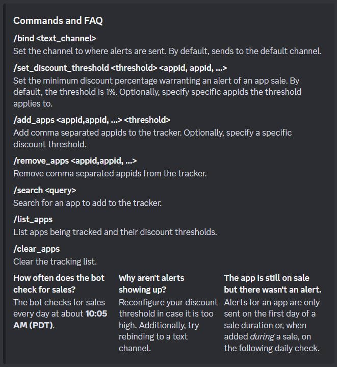

<h1 align="center">Steam Sale Bot</h1>

<p align="center">
    
</p>

<p align="center">
  Track apps on Steam, and get alerts when they go on sale or release!
</p>

<h2 align="center">
    <a href="https://discord.com/api/oauth2/authorize?client_id=1186785835866132540&permissions=51200&scope=bot" target="_blank">
        Invite Link
    </a>
</h2>

## Commands and FAQ



## 🎴 Screenshots


## 🤖 Self-Hosting

Hosting this bot yourself requires a Discord bot token, the Go CLI, and a MongoDB cluster.

Make sure to set the environment variables needed in the `main.go` file.

### Installation Steps

```
git clone https://github.com/jasonly027/steam_sale_discord_bot_go.git

cd steam_sale_discord_bot

go run ./main.go
```


## ⚙️ Technologies

- <b><a href="https://github.com/bwmarrin/discordgo" target="_blank">DiscordGo</a></b> - Go bindings for
  Discord's REST API and WebSocket-Events.
- <b><a href="https://github.com/Revadike/InternalSteamWebAPI" target="_blank">Steam's Internal Web API</a></b> -
  Community-driven documentation of the API can be accessed there.
  Used for deserializing Steam's IWA endpoints.
- <b><a href="https://www.mongodb.com/" target="_blank">MongoDB</a></b> - A NoSQL cloud database.
